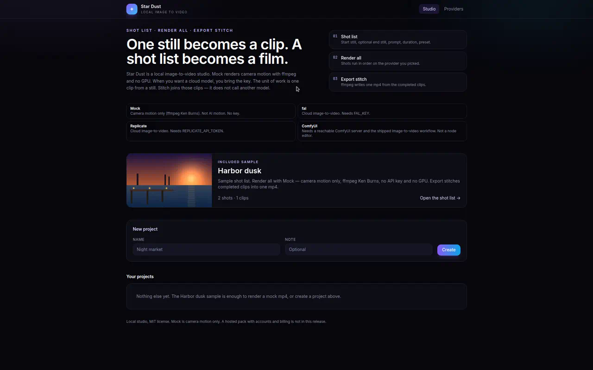
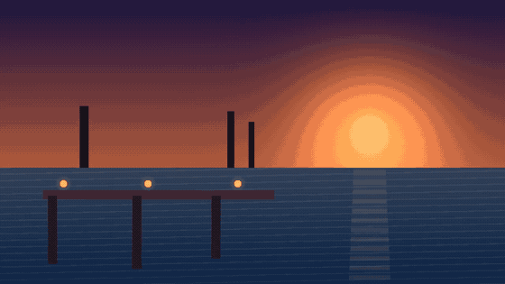
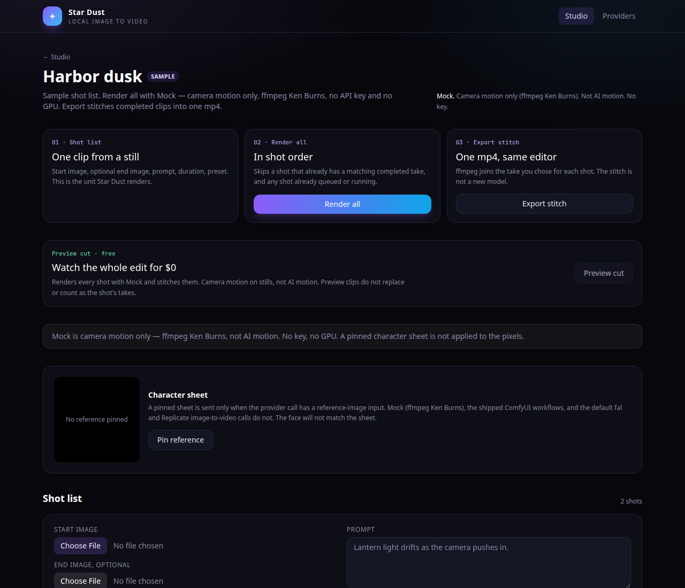

# Star Dust

Star Dust is a local image-to-video studio that works offline with ffmpeg and no GPU. `docker compose up --build` opens the included Harbor dusk sample: render a mock mp4 and download it.







Mock is camera motion only — a Ken Burns move on the still, not AI motion. The shot list is the product: one clip from a still, render the list in order, then export one stitched mp4. That stitch is ffmpeg. It is not another model.

## Which backend should I use?

Clone it and leave Mock on if you only want the shot list and a stitched mp4. The other rows are for when you want generated motion. None of them lock a character, lip-sync a performance, or turn the shot list into a long film. One clip is still the unit.

| Backend | Use it when | Hardware and keys |
| --- | --- | --- |
| Mock (free) | You want the edit with no GPU and no account. CI renders this. | ffmpeg only. Camera motion on the still, not AI motion. No key. |
| ComfyUI on this machine | ComfyUI is already running where Star Dust runs. | No key in Star Dust. Pick SVD, Wan 2.2 TI2V-5B, or LTX-2.3 per shot or per project. Start with the low-memory preset. Memory notes are guidance, not a measured benchmark. |
| ComfyUI on another machine or a rented GPU | You do not have a card that can hold the model (an AMD iGPU laptop is the usual case). Run ComfyUI on a desktop or a rented GPU and point Star Dust at it. | Set `COMFYUI_BASE_URL`. If that host expects a header, set `COMFYUI_AUTH_HEADER`. Both stay in the environment. They are not saved in the database and not shown in the UI. |
| fal | You want a cloud clip and you already have a fal key. | `FAL_KEY` in the environment. A per-second rate you type yourself. That total is your estimate, not a vendor quote. |
| Replicate | Same idea, on Replicate. | `REPLICATE_API_TOKEN` in the environment. Same kind of self-entered rate. |

## Docker

```bash
docker compose up --build
```

Open [http://localhost:3000](http://localhost:3000). Harbor dusk is already on the studio page, with two shots and a still. Leave the provider on **Mock**, choose **Render all**, then **Export stitch** or download the mp4.

The app listens on port 3000. Clips and the SQLite database stay in `./data` on the host. Keys are not baked into the image. Stripe, PayPal, and a license key are not required. If you later point at fal or Replicate, pass `FAL_KEY` or `REPLICATE_API_TOKEN` in the environment. For ComfyUI on another machine, pass `COMFYUI_BASE_URL` and, only if that server asks for it, `COMFYUI_AUTH_HEADER`.

## Providers

| Provider | What you need |
| --- | --- |
| Mock | No key. Camera motion only (ffmpeg Ken Burns). Not AI motion. |
| fal | `FAL_KEY` |
| Replicate | `REPLICATE_API_TOKEN` |
| ComfyUI | A reachable server, on this machine or at `COMFYUI_BASE_URL`. One of the shipped workflows. Not a node editor. |

Before a fal or Replicate job is created, Star Dust shows the model name. A key is required. Some vendors bill failed generations, and unused credits can expire. This app does not fetch a vendor price.

In Settings you can type a per-second rate for each fal or Replicate model. The rate is a plain setting, not a key. Before a paid **Render all**, Star Dust shows seconds times that rate and labels it as your own estimate, not a vendor quote. If no rate is set, it says the cost is unknown and does not show a number. An optional budget cap blocks a paid Render all whose estimate is over the cap. Mock and ComfyUI are not billed here.

If the key is missing, the job is not marked running. The error names `FAL_KEY` or `REPLICATE_API_TOKEN`.

ComfyUI posts the workflow you picked, polls `/history`, and downloads the video. If the server is down, the job fails with the URL and the status. An out-of-memory error, a missing node, or a missing model fails the job the same way. It does not sit on "running".

Check server on the Providers page calls `/system_stats`. When `COMFYUI_BASE_URL` is set, that check uses the environment host and does not print the URL. `COMFYUI_AUTH_HEADER` is sent as the `Authorization` value (override the header name with `COMFYUI_AUTH_HEADER_NAME`). The page shows whether the header is present. It never shows the value.

Pick the graph in Providers (the app default), on the project, or on a shot. A shot overrides the project, and the project overrides Providers. The low-memory preset is the same idea: start at about 480p, short clip. Each graph's card says what that preset actually writes.

**Stable Video Diffusion** (`workflows/comfyui-svd-i2v.api.json`) does not read the text prompt, and it does not take a second reference image. The job says so. It expects `svd_xt_1_1.safetensors` in `ComfyUI/models/checkpoints`. Core nodes only. Default size in the graph is 1024×576, with the shot duration mapped to about 14–25 frames at 6 fps. The low-memory preset uses 768×448 and 14 frames. There is no published system-RAM number here. It is the lightest of the three files.

**Wan 2.2 TI2V-5B** (`workflows/comfyui-wan22-ti2v-5b.api.json`) reads the prompt. Star Dust injects the start image, the prompt, a frame count from the shot duration (16 fps, snapped to the Wan 4n+1 length, capped at 81 frames), and the output size (the still fitted inside 832×480). The low-memory preset keeps that 832×480 box and caps the length at 17 frames. It does not take the end image. It is one short clip. Place these files on the ComfyUI server:

```
ComfyUI/models/diffusion_models/wan2.2_ti2v_5B_fp16.safetensors
ComfyUI/models/text_encoders/umt5_xxl_fp8_e4m3fn_scaled.safetensors
ComfyUI/models/vae/wan2.2_vae.safetensors
```

ComfyUI's own notes say this 5B graph fits about 8 GB VRAM with native offloading. That is a VRAM note, not a system-RAM measurement. The text encoder and the diffusion file are large, and offloading uses system RAM. Star Dust does not install the weights and does not publish a measured RAM figure. The loader uses ComfyUI's default weight dtype so offloading stays ComfyUI's job.

**LTX-2.3 distilled FP8** (`workflows/comfyui-ltx23-i2v.api.json`) reads the prompt. Star Dust injects the start image, the prompt, the frame count, the size, and the seed. Default size is the still fitted inside 960×544, at 24 fps, length snapped to 8n+1 and capped at 121 frames (about five seconds). The low-memory preset fits the still inside 832×480 (about 480p) and caps the length at 25 frames (about one second). The graph builds the audio latent LTX-2.3 expects, then saves a silent mp4. It does not take the end image. It is one short clip.

The graph uses core nodes from a current ComfyUI (the LTX-2 nodes in core, plus `CheckpointLoaderSimple`, `CLIPTextEncode`, `LoadImage`, `KSamplerSelect`, `RandomNoise`, `CFGGuider`, `SamplerCustomAdvanced`, `VAEDecodeTiled`, `CreateVideo`, and `SaveVideo`). It does not require ComfyUI-LTXVideo. Place these files on the ComfyUI server:

```
ComfyUI/models/checkpoints/ltx-2.3-22b-distilled-fp8.safetensors
ComfyUI/models/text_encoders/gemma_3_12B_it_fp4_mixed.safetensors
```

The checkpoint is the distilled FP8 file from [Lightricks/LTX-2.3-fp8](https://huggingface.co/Lightricks/LTX-2.3-fp8). The text encoder is the Comfy-Org split file `gemma_3_12B_it_fp4_mixed.safetensors` from [Comfy-Org/ltx-2](https://huggingface.co/Comfy-Org/ltx-2). The same checkpoint also supplies the video VAE and the audio VAE. Star Dust writes those filenames on every run.

Lightricks' ComfyUI-LTXVideo README lists a CUDA GPU with 32 GB+ VRAM for the full setup. This graph loads the distilled FP8 checkpoint instead of the full BF16 file `ltx-2.3-22b-distilled-1.1.safetensors`. That is a smaller official file, not a promise that it runs in 8 GB. Community reports, including r/comfyui threads, describe "runs on 8 GB" setups that still need on the order of 32–64 GB of system RAM when the weights do not fit in VRAM. Treat that as a warning. Star Dust did not measure it. If the job runs out of memory, it fails and names that preset.

A GGUF UNet is optional and is not what this file loads. People who want that path install [ComfyUI-GGUF](https://github.com/city96/ComfyUI-GGUF) and edit the diffusion loader. Star Dust does not install custom nodes or weights.

A pinned character sheet is sent only when the call has a reference-image input. Mock, the shipped ComfyUI workflows, and the default fal and Replicate calls do not. The face will not match the sheet.

## Shot list

1. **Shot list** — start image, optional end image, prompt, duration, preset. A project can also hold shared style / character text. It is empty unless you set it.
2. **Preview cut** — every shot renders with Mock and stitches, so you can watch the whole edit for $0. The label is camera motion on stills, not AI motion. Preview clips do not overwrite or count as a shot's take.
3. **Render all** — shots run in order on the provider you picked. A shot is skipped when it already has a completed take for the same provider, model, image(s), prompt, duration, and preset, and when a take is already queued or running. **Re-render** on a shot forces a new take. Previous takes stay on disk and in the database. Pick which take the stitch uses.
4. **Export stitch** — the chosen take of each completed shot becomes one mp4. ffmpeg does that. It is not another model. The join is a hard cut, or a short crossfade (0.25–1s) for the whole project or for one join.

## Multi-shot continuity

People making anything longer than one clip usually save the last frame of clip N and feed it in as the start image of clip N+1, then fight a seam at the join.

**Start from previous shot's last frame** does that inside the shot list. When the option is on and the previous shot has a finished take, ffmpeg extracts that clip's final frame, stores it like any other still, and the next take uses it. Your original still stays on the shot. Turn the option off and the next render uses that still again. If the previous shot is not rendered yet, this shot waits behind it when that take is already queued, or it tells you to render the previous shot first. It does not silently use your still. Mock, fal, Replicate, and ComfyUI all go through the same step. Preview cut does not: it is camera motion on your stills.

**Joins** are a hard cut (the default, same as before) or a crossfade of 0.25, 0.5, 0.75, or 1 second. Set it on the project, or override the join that leads into one shot. Star Dust does not grade colour or brightness across the join. A measured match on a short generated clip is easy to wash the next shot out, so it is not attempted.

Chaining helps continuity of pose and framing. Identity and details still drift over many chained shots. Star Dust does not lock characters, does not lip-sync, and does not turn the shot list into a long film. One clip is still the unit.

### Shared style / character text

Last-frame chaining is one continuity lever. Shared wording is the other cheap one.

**Shared style / character text** is a single project field. Harbor dusk leaves it empty, so those sample prompts are sent alone and the dusk harbor mood stays in the shot text. When you set the field, every take and every preview job stores the effective prompt: that text, then a comma, then the shot prompt. A double comma or a dangling comma at the join is dropped. The shot prompt stays the action or scene. Star Dust does not copy the base into each shot.

This is the shared-base pattern people rebuild in ComfyUI (FunPack Prompt Combiner / Story Writer style): the same words in front of every shot. It is text only — not a character lock. Identity can still drift across shots. Together with last-frame chaining, a reel can share wording and a starting frame. Star Dust does not lock a face, lip-sync, or turn the shot list into a long film. One clip is still the unit.

Gallery: download one take, or download all takes as a zip. Preview clips stay out of that gallery. Jobs can be cancelled and retried.

## Local install

ffmpeg is required (`ffmpeg -version`).

```bash
npm install
cp .env.example .env.local   # only when you use fal or Replicate
npm run dev
```

Open [http://localhost:3000](http://localhost:3000).

```bash
npm run demo
```

`npm run demo` renders one mock mp4 from the sample still and exits 0. No API key.

```bash
npm run lint
npm run build
npm run test:providers
```

`test:providers` checks the minor-content refusal (the image is not stored), missing-key failures, a ComfyUI stand-in that queues, polls, and downloads, take skipping, take selection in the stitch, an unknown cost when no rate is set, a budget cap that blocks a paid Render all, Wan and LTX workflow injection against that stand-in, workflow selection, remote-URL and auth-header failures, out-of-memory and missing node or model failures, and a local stitch. It also renders a 3-shot Mock project with last-frame chaining and a crossfade, with no API key, and checks that the mp4 duration matches the clips minus the fades. It also checks that a project style base is joined onto Mock take and preview prompts, that an empty style base leaves the shot prompt unchanged, and that a joined prompt which is sexual content involving a minor is refused before a job is queued. It also checks that Stripe and PayPal left unset stay on that same path, that a signed Stripe webhook and a mocked PayPal capture each grant a credit pack without calling those networks, that a low balance blocks a paid Render all, and that an unset license key still renders Mock. It does not call fal, Replicate, Stripe, PayPal, or a real ComfyUI server.

## Safety

Star Dust refuses sexual content involving a minor before a job is queued and does not store that image.

## Hosted credits / self-hosted pack

Docker, Mock, the shot list, preview cut, and the stitch are the free studio. They need no account, no Stripe key, no PayPal key, and no license key. `npm run demo` stays offline.

**Hosted credits** are one-time packs, not a subscription. There is one balance for this installation, stored in the local SQLite file, not a per-person account. Stripe and PayPal add to that same balance. Either can be set alone, or both.

Stripe turns on with `STRIPE_SECRET_KEY` and a one-time price id. Use `STRIPE_PRICE_CREDITS` (credits come from `STRIPE_CREDITS_AMOUNT`, or 100 if that is empty) or a named pair such as `STRIPE_PRICE_CREDITS_STUDIO` and `STRIPE_CREDITS_STUDIO`. The webhook adds credits after Stripe reports the payment as paid. The same Checkout session cannot add credits twice.

PayPal turns on with `PAYPAL_CLIENT_ID`, `PAYPAL_CLIENT_SECRET`, and `PAYPAL_PACK_AMOUNT`. `PAYPAL_MODE` is `sandbox` or `live`; empty means sandbox. Credits for that amount come from `PAYPAL_CREDITS_AMOUNT`, then the matching Stripe pack size, then 100. A named pack uses `PAYPAL_PACK_AMOUNT_STUDIO` and `PAYPAL_CREDITS_STUDIO`. Checkout is a PayPal order with intent `CAPTURE`. The server captures it when the buyer returns, and `PAYMENT.CAPTURE.COMPLETED` can confirm the same order when `PAYPAL_WEBHOOK_ID` is set. The same PayPal order cannot add credits twice.

A paid fal or Replicate **Render all** estimates one credit per second (override with `STAR_DUST_CREDITS_PER_SECOND`) and is blocked when the balance is lower. Credits are spent when those jobs are queued. A single shot and a retry use the same balance, so they cannot skip it. The operator's `FAL_KEY` or `REPLICATE_API_TOKEN` still has to be in the environment. Mock, ComfyUI, preview cut, and stitch do not spend credits. If Stripe and PayPal are both unset, the pay buttons stay hidden and Render all behaves as before: your own key, your own per-second rate, and the optional budget cap.

**Self-hosted pack** is optional and does not gate that core. Set `STAR_DUST_LICENSE_KEY` to unlock a local worker plan (`workflows/pack-hold.json`, `npx tsx scripts/pack-worker.ts <projectId>`, and `GET /api/projects/<id>/pack-worker`). Any non-empty value unlocks it. The key is read from the environment only. Star Dust does not call a license server, so an air-gapped Mock render still runs when the key is unset. Without the key, Mock, fal, Replicate, ComfyUI, and the shipped SVD, Wan, and LTX graphs stay available.

## Layout

```
src/app/                 studio UI and API
src/lib/storage.ts       SQLite (data/star-dust.sqlite), including the optional credit ledger
src/lib/credits.ts       hosted credit balance, off unless Stripe or PayPal packs are set
src/lib/paypal-billing.ts  PayPal order capture for that same balance
src/lib/pack.ts          optional self-hosted pack (local license check)
src/lib/providers/       mock, fal, Replicate, ComfyUI
workflows/               shipped ComfyUI graphs (SVD, Wan 2.2 TI2V-5B, LTX-2.3) and the optional pack plan
samples/                 Harbor dusk still and shot list
```
